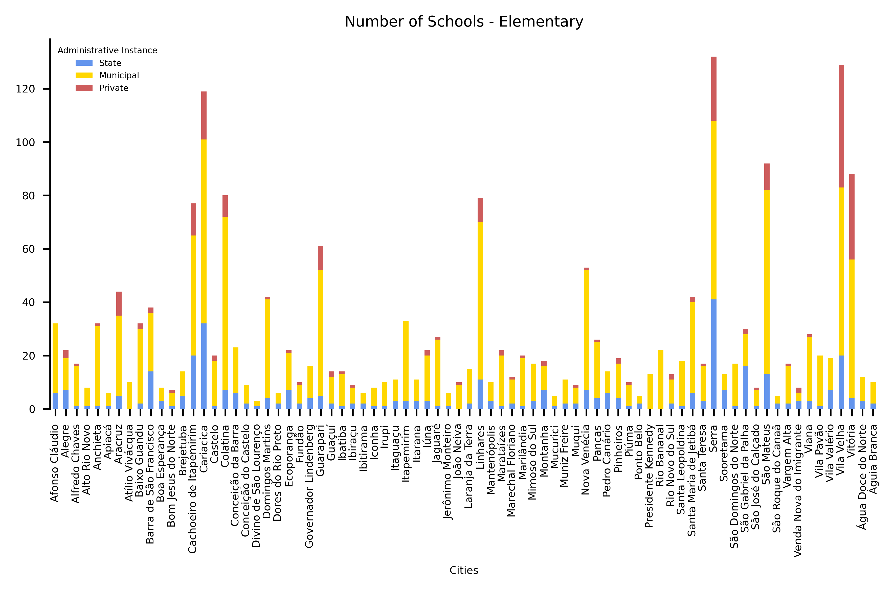
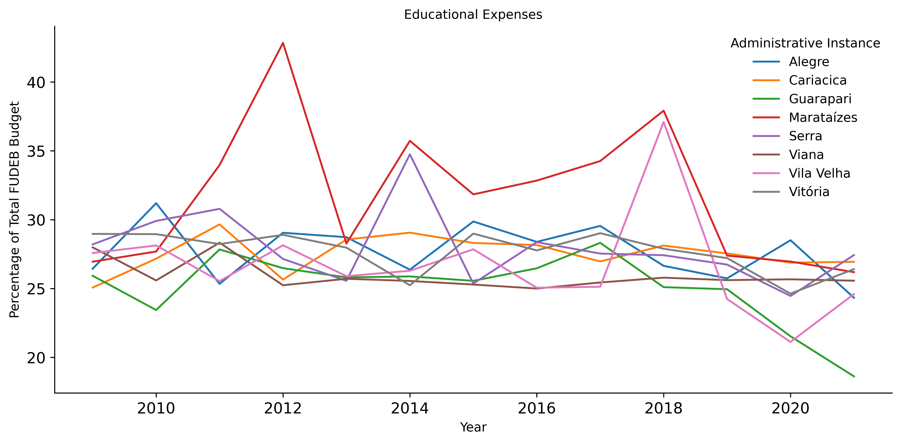

# Portifolio Projects to Learn Programming and Data Science

These will be my forays into learning techniques for data science. I'll track my
projects here with a quick note on what each project does.

## 📑  Natural Language Processing - NLP

In this code I used NLP techniques to interpret text data that I was working with in my PhD and to learn some techniques I was going to use in other context. The text used to perform this analysis was a transcript of a chemistry class for undergraduation students.

I've started with pre-processing techniques including tokenization, text normalization and data cleaning. Once in a standard format, various regular and machine learning techniques can be applied to better understand the data. First I did a classic word cloud to visualize the text.

Also worked with modeling techniques to score the sentiment of a text. To perform a sentiment analysis, I did a subjectivity score to understand how much the teacher speech was opiniated (if what he was saying was a objective fact or a subjective opinion) and a polarity score to understand if what he is talking is negative or positive.

## :pencil2: Educação ES :books:

In this code I analysed educational data from my home state using data from Instituto Nacional de Estudos e Pesquisas Educacionais Anísio Teixeira (INEP). The institute is responsible for promoting studies, research and periodic evaluations on the Brazilian educational system, with the objective of subsidizing the formulation and implementation of public policies for the educational area.

This is an analisys of elementary schools per cities aggregating them by their administrative instance (municipal, state, federal or private).

:school_satchel: **Elementary**

:memo: **Middle School**

As expected most of elementary teaching is done by the city administrative instance while most of middle school teaching is done by the state administrative instance. The federal constitution defines that the municipality takes care of early childhood education and also elementary school 1; Middle school is a priority for the state government, but they also manage elementary schoool 2. The union, in turn, is responsible for the financial and technical coordination while conducting the federal universities.

Also did an analyze of number of students per public school in elementary and middle school.

:school_satchel: **Elementary**

:memo: **Middle School**

Total public resources invested in maintenance and development of education in the public education network.The Constitution establishes that municipalities must apply at least 25% (twenty-five) of the revenue resulting from taxes, including that from transfers, in the maintenance and development of education.

Total public resources invested in maintenance and development of education **divided by the number of students enrolled in the public education network**. The higher the position in the ranking, the greater the investment in maintenance and development of education per student in the education network.

